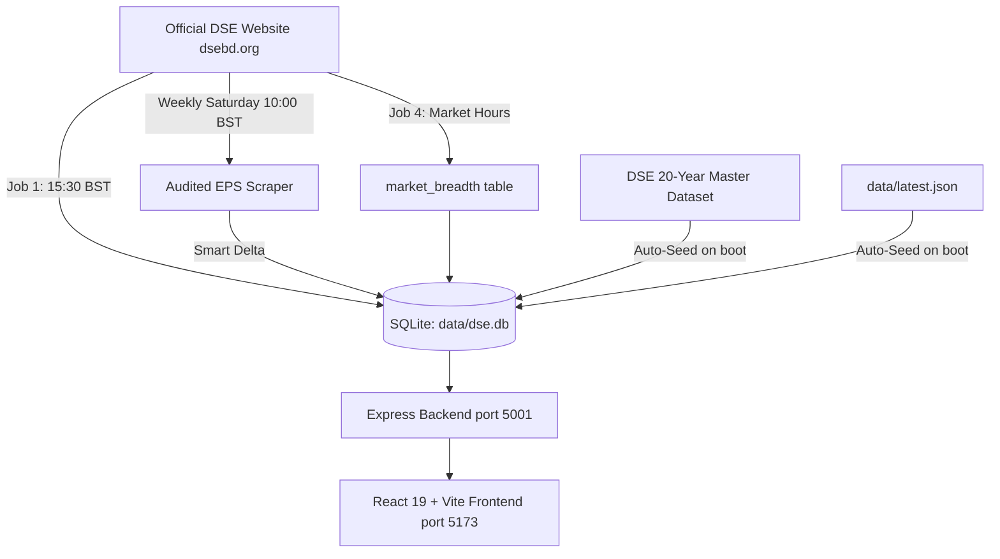

# DSE Analytics & Buffett Value Terminal — Workspace Directives & Core Rules

> [!IMPORTANT]
> ### 🛡️ BINDING CORE ENGINEERING RULES (MANDATORY ON ALL TURNS & REFACTORINGS)
> 1. **DO NOT CHANGE THE UI** — Unless the user explicitly requests a UI change in their prompt. Keep all components, modal sections, layouts, badges, and visual styling intact.
> 2. **NO HARDCODED / SYNTHETIC / RANDOM VALUES** — Never use hardcoded numbers, fake years, random generators (`Math.random()`), or simulated mock dictionaries. Every value must come directly from SQLite `data/dse.db`. If a value is missing or unavailable, show `—` / `N/A` / `null` or **ask the user directly**.
> 3. **AUDITED FINANCIAL DISCLOSURES (STRICTLY FROM DB)** — All Audited Financial Disclosures (Audited P/E, EPS, NAVPS, Paid-Up Capital, Authorized Capital, Dividend Yield, Audited Period, Quarterly Disclosure) MUST come strictly from verified `company_fundamentals` in the SQLite database.
> 4. **7-POINT FUNDAMENTAL MATRIX DATA ORIGIN RULES** —
>    - *From DB (`company_fundamentals` & `price_history`):* Return on Equity, Debt/Equity, Current Ratio, Audited Basic EPS.
>    - *From Daily Session Feed:* Daily P/E ($\text{LTP} \div \text{DB EPS}$), Closing Momentum ($\text{Change \%}$), Trading Volume.

---

## 1. Project Overview & Commercial Grade Standard
This application is a **commercial-grade, production-ready institutional analytics dashboard for the Dhaka Stock Exchange (DSE)**.
- **Authenticity & Accuracy:** Zero simulated/fake/made-up numbers. All prices, EPS, NAVPS, and fundamentals MUST originate strictly from the DSE exchange filings and SQLite master database.
- **Audited Data Exclusivity:** Only officially published audited financial figures (Annual/Quarterly audited disclosures) are displayed. If a metric is unpublished or unavailable, show `"Not Available live"` / `null` / `'—'`.
- **Smart Delta / 0-Write Scrapers:** Scrapers check existing DB values before writing. If identical, 0 database writes occur.

---

## 2. Architecture & Data Flow

### Key Modules:
- **`server/db.js`**: SQLite DB interface (`data/dse.db`). Handles tables `price_history`, `company_fundamentals`, `market_breadth`. Automatically seeds from `data/DSE_20_Year_Master_Dataset_2005_2026.xlsx` and `data/latest.json` on startup.
- **`server/index.js`**: Express backend, REST API (`/api/stocks`, `/api/history/:symbol`, `/api/market-pulse`, `/api/export/excel`, `/api/jobs/status`), and `node-cron` automation in Dhaka timezone (`Asia/Dhaka`).
- **`server/scrapers/audited_eps_scraper.js`**: Standalone weekly crawler parsing verified Audited Financial Statements from `displayCompany.php`.
- **`src/services/dseData.js`**: Buffett Value metrics (Graham Number, Moat, Margin of Safety, Dynamic Buffett Score).
- **`src/services/api.js`**: Dynamic routing between `localhost:5001` and Render cloud API with bundled zero-fail fallback snapshot.

---

## 3. Automation Cron Jobs (Dhaka Timezone: UTC+6)
1. **Job 1 (Closing Prices Archive):** Sun-Thu @ 15:30 BST (`30 15 * * 0-4`)
2. **Job 3 (Daily Fundamentals Delta):** Sun-Thu @ 16:00 BST (`0 16 * * 0-4`)
3. **Weekly Audited EPS Master Scraper:** Every Saturday @ 10:00 BST (`0 10 * * 6`)
4. **Job 4 (Market Breadth):** Every 30m during market hours (10:00–15:00 BST, Sun-Thu)

---

## 4. Commands Quick Reference
- `npm run dev`: Start frontend Vite server (`http://localhost:5173`)
- `npm start` / `npm run scraper-server`: Start Node backend server (`http://localhost:5001`)
- `npm run scrape:audited`: Run standalone Audited EPS crawler on all 440 companies
- `npm run build:all "commit message"`: Single-command validation, frontend compilation, git commit, and cloud deployment to Render & GitHub
